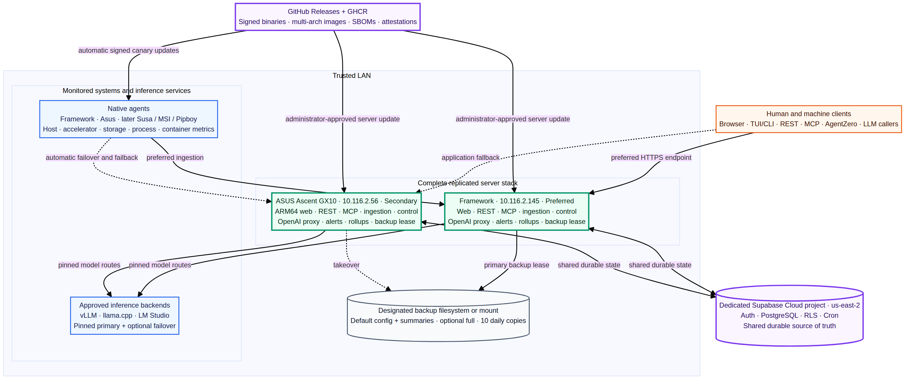
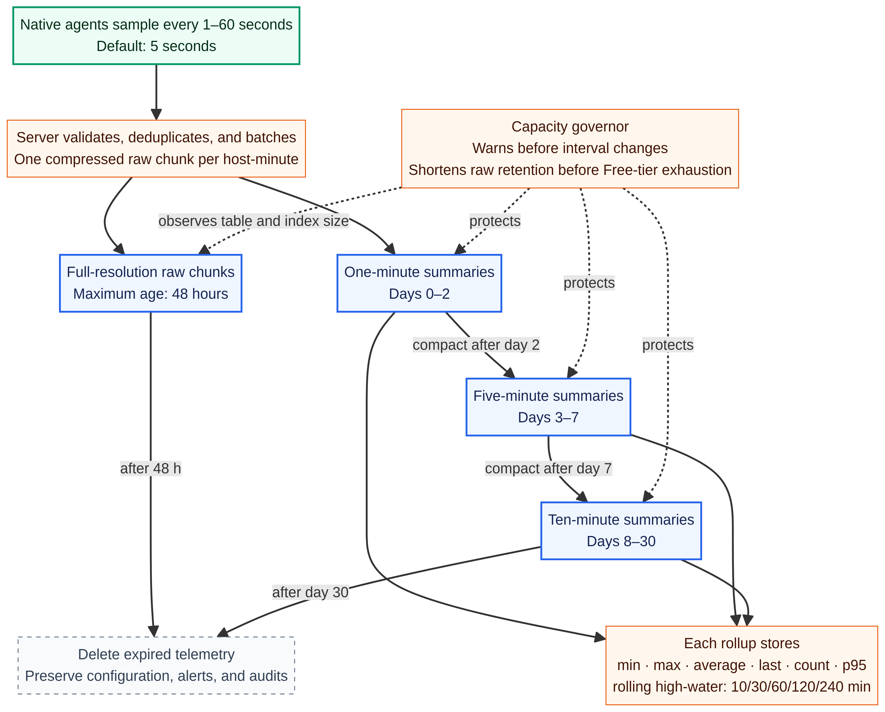

# NodeScope Release 1 Architecture and Technology Proposal

**Status:** Revised proposal for review; implementation has not started  
**Author:** Manus AI  
**Date:** July 20, 2026  
**Working repository:** `pakgrou-porg/NodeScope`  
**License:** Apache License 2.0  
**Companion review:** [NodeScope critique response matrix](NodeScope_Critique_Response.md)

## Executive recommendation

I recommend building **NodeScope as a purpose-built, open-source observability and control plane**, rather than assembling Grafana and a second local time-series database for Release 1. The proposed implementation uses a **Go core** for the native agent, replicated server, ingestion service, OpenAI-compatible telemetry proxy, REST API, MCP server, updater, TUI, and CLI. A **React and TypeScript** application provides the desktop-first browser console. A dedicated **Supabase Cloud project in `us-east-2`** supplies PostgreSQL, invite-only magic-link authentication, RLS, and scheduled database jobs.

Each server replica runs the **complete server stack from one Docker Compose specification compatible with Portainer**. Framework at `10.116.2.145` is preferred; Asus at `10.116.2.56` is secondary. Every monitored machine, including those two server hosts, runs only a small native agent. This architecture satisfies the agreed requirements while keeping non-server systems simple and avoiding direct database credentials on monitored hosts. **Supabase Free is an evaluation target, not an assumed production fit**: the full five-host feature set is likely to require shorter raw retention or a paid/self-hosted tier unless real Framework and Asus measurements prove that the steady state fits safely below the operating ceiling.

> **Recommendation requiring approval:** Proceed with a purpose-built Go control plane and agent, a React/TypeScript web console, compact host-minute telemetry chunks in Supabase, and two active full-stack replicas. Add a mandatory storage-feasibility gate on real Framework and Asus data before committing to the 48-hour raw-retention target. Do not add Grafana, Prometheus, automated process/container restarts, RDMA performance telemetry, Windows packaging, or mobile optimization to Release 1.

## 1. Agreed Release 1 baseline

The following table consolidates the decisions made during discovery. It should become the initial product requirements baseline in the public repository.

| Area | Agreed Release 1 requirement |
|---|---|
| Product | **NodeScope**, public Apache-2.0 repository; exact `pakgrou-porg/NodeScope` slug was available when checked. |
| Supported platforms | Full Release 1 support for **Framework** and **Asus Ascent GX10**. Later order: Susa, MSI, Pipboy. |
| Server deployment | Complete stack on Framework and Asus using the same Docker Compose/Portainer YAML; both replicas operate independently against shared Supabase state. |
| Preferred order | Framework `10.116.2.145` first; Asus `10.116.2.56` second. Agents and inference callers fail over and later fail back. |
| Database | Dedicated clean Supabase project in `us-east-2`. Cloud Free is the measurement target; paid or self-hosted Supabase is a probable requirement if the real steady-state design exceeds the 80% operating ceiling. |
| Agent | Native system service on each host; no NodeScope Docker requirement on non-server systems. Preflight reports missing dependencies with installation commands but never installs them. |
| Sampling | Global interval from **1–60 seconds**, default **5 seconds**, with a per-host override. |
| Retention | Requested maximum: raw data up to 48 hours; one-minute summaries through day 2; five-minute summaries through day 7; ten-minute summaries through day 30. The raw duration is committed only after the hardware storage-feasibility gate. |
| Summary statistics | Count, minimum, maximum, average, last, and p95 using versioned DDSketch with 1% default relative accuracy, plus rolling high-water values for 10, 30, 60, 120, and 240 minutes. |
| Baseline metrics | CPU, RAM, GPU, platform-accurate dedicated or unified-memory views, NPU, temperatures, mounts, storage capacity, selected process/service health, all-container inventory, selected-container alerts, runtime health, token usage, TTFT, prompt processing, generation throughput, replica health, and detection-only ConnectX inventory. |
| Storage inventory | Local filesystems, network mounts, and Docker volumes; learned automatically and refreshable by an authorized actor. |
| Browser access | Desktop-first, invite-only Supabase magic links; Viewer, Operator, and Administrator roles, applied fleet-wide. Framework is the deterministic default callback; Asus is an explicit emergency callback. |
| Terminal access | Interactive TUI and scriptable CLI on any supported platform; table, JSON, and NDJSON output. Local SSH use can trust a protected local socket; remote use requires a revocable credential. |
| Agent/tool access | Release 1 REST API, remote HTTPS MCP server, and a dedicated adapter contract-tested against the exact AgentZero v2.5 release commit. Authorized agents may autonomously perform exposed actions. |
| Release 1 actions | Change global/per-host collection intervals and refresh learned storage baselines. Human users and agents use the same authorization and audit model. |
| Deferred actions | Process/service and Docker restarts. |
| Inference proxy | Runs on both replicas. Callers use Framework first and Asus as application fallback. Routes pin to one approved backend with optional automatic backend failover and failback. |
| Privacy | Prompt and response content is never persisted or logged. Usage is attributed to a named API-key client and source host. |
| Alerts | In-console only; editable platform-aware defaults, threshold duration, severity, cooldown, suppression, acknowledgement, and recovery. |
| Backups | Primary-only daily backup with Supabase-authoritative fenced lease and secondary takeover; ten copies on a target mounted and writable on both replicas. Default includes configuration and summary telemetry; “full” includes retained raw telemetry. Encryption is not required. |
| Updates | Automatic signed canary updates for native agents; administrator-approved staged updates for server replicas. |

## 2. Research findings that materially shape the design

The Asus Ascent GX10 uses an **ARM v9.2-A GB10 CPU**, Ubuntu Linux, and **128 GB of unified LPDDR5x memory**. NVIDIA’s DGX Spark documentation describes a 20-core Arm CPU, integrated Blackwell GPU, 10 GbE, and ConnectX-7 networking.[1] [2] Release 1 therefore needs `linux/arm64` server images and native binaries in addition to Framework’s `linux/amd64` artifacts.

The GX10 cannot be modeled as a conventional discrete-GPU workstation. NVIDIA explicitly describes its unified-memory architecture and warns that `cudaMemGetInfo` can understate allocatable memory because it does not account for DRAM that can be reclaimed through swap.[3]

> “DGX Spark systems use a unified memory architecture (UMA), where the GPU shares system memory (DRAM) with the CPU and other compute engines.” — NVIDIA DGX Spark Known Issues[3]

NodeScope must consequently provide a dedicated **Unified Memory** panel showing OS `MemAvailable`, `SwapFree`, huge-page state, CUDA/runtime allocatable memory when available, and per-process GPU memory where NVIDIA exposes it. Current NVIDIA documentation states that `nvidia-smi` may report `Memory-Usage: Not Supported` on DGX Spark iGPU platforms because they do not have dedicated framebuffer memory.[3] Optional vendor memory fields are therefore capability-detected, never assumed. Contradictory OS and runtime values are displayed side by side with source and semantics; they are not reconciled into a fabricated “VRAM free” value.

Framework’s Ryzen AI Max+ 395 configuration includes Radeon 8060S graphics with 40 compute units.[4] AMD documents `xrt-smi` as the management interface for integrated Ryzen AI NPUs, including JSON output for readiness, firmware, power mode, estimated power, active contexts, errors, latency, and throughput where supported.[5] AMD SMI exposes GPU utilization, temperatures, power, clocks, memory, PCIe, process, and error information, but AMD recommends library interfaces rather than treating its example CLI as the most robust integration.[6]

The LLM runtimes have different observability surfaces. vLLM exposes production metrics including TTFT, inter-token latency, request state, token counts, and cache behavior.[7] The official llama.cpp server can expose Prometheus-compatible `/metrics`, `/health`, and slot endpoints when enabled.[8] LM Studio provides authenticated REST, OpenAI-compatible, model-management, streaming, and headless interfaces, but its public documentation does not establish an equivalent Prometheus engine endpoint.[9] The proxy is therefore essential for consistent **client attribution and end-to-end timing**, while runtime-native metrics remain valuable for engine-level detail.

The critical cloud constraint is Supabase Free’s **500 MB database size**, shared CPU, 500 MB RAM, and 5 GB egress; managed daily backups are not included.[10]

> “500 MB database size … Shared CPU • 500 MB RAM” — Supabase Free plan[10]

The original illustrative estimate consumed roughly 337 MiB before indexes, current state, usage, alerts, audits, MVCC overhead, and maintenance headroom. That margin is not sufficient evidence that Free will work. **The revised proposal treats a paid or self-hosted tier as a probable outcome for the full feature set**, and requires real capture/codec measurements before making the 48-hour retention commitment. Free projects can also pause after one week of inactivity.[10] Normal NodeScope ingestion should prevent inactivity, but the operations guide must document project wake-up if the entire fleet is offline for an extended period.

Supabase Cron uses `pg_cron`, supports source-controlled SQL schedules, and can invoke database functions or HTTP endpoints.[11] This is suitable for deterministic cleanup and lease housekeeping, but high-frequency telemetry must be batched outside a row-per-metric schema.

## 3. Architecture alternatives

The project can be built several ways. The following comparison includes the recommended approach and viable lighter or heavier alternatives; approval should select the final route.

| Approach | Trade-offs | Cost | Setup complexity |
|---|---|---:|---:|
| **A. Purpose-built NodeScope control plane with compact Supabase telemetry bundles** | Directly supports the browser, TUI/CLI, REST, MCP, AgentZero, proxy, routing, roles, audits, discovery approval, and storage-baseline workflows. It minimizes non-server footprint. The principal engineering work is the compact telemetry format and history query layer. | Open-source components; Supabase Free target with paid/self-hosted escape hatch. | Medium |
| **B. Prometheus-compatible collector and Grafana plus a separate control API** | Mature metric querying and dashboards, but still requires custom software for authentication, actions, credentials, routing, AgentZero, MCP, and auditing. Adds another database, containers, backups, and retention policies. | Open source, but higher local RAM, disk, and operational cost. | High |
| **C. Agents write directly to Supabase and the browser reads it** | Lowest initial server footprint, but distributes privileged write credentials, couples agents to schema, weakens validation and deduplication, and complicates proxying, local SSH trust, and upgrades. | Lowest initial footprint; highest security and maintenance risk. | Low initially, high over time |

**Recommendation:** Approve Approach A. Keep Grafana as a post-Release 1 read-only integration. Reject direct agent-to-database writes.

### 3.1 Implementation-language alternatives

| Stack | Strengths | Weaknesses | Assessment |
|---|---|---|---|
| **Go core + React/TypeScript web console** | Small native binaries; clean Linux AMD64, Linux ARM64, and Windows AMD64 distribution; strong streaming and concurrency; one shared codebase for agent, server, proxy, CLI, TUI, updater, REST, and MCP. The official MCP Go SDK supports current and prior protocol versions.[16] | Vendor GPU/NPU adapters may still need dynamic libraries, cgo, or structured CLI fallbacks. The repository remains polyglot because the web console is TypeScript. | **Recommended.** Best fit for a simplified native agent and multi-architecture server. |
| **Rust core + React/TypeScript web console** | Strong memory safety, efficient binaries, good TUI ecosystem, and excellent proxy performance. | Slower initial delivery and contributor onboarding; comparable vendor FFI complexity; more bespoke service/updater work. | Strong alternative if Rust becomes a project preference. |
| **Python/FastAPI + Textual + React** | Fast prototyping and easy vendor CLI/SDK integration; natural AgentZero wrapper. | Larger runtime, more fragile standalone packaging, heavier updates, and a weaker fit for a small signed native agent across ARM64 and Windows. | Suitable for prototypes, not recommended for the distributable core. |

## 4. Recommended topology



Both replicas run the complete application and remain stateless except for bounded caches and local backup files. Supabase is the durable source of truth. Every write path is idempotent or protected by a unique constraint, so retries across replicas do not double-count telemetry or repeat actions.

The Compose stack should contain **one long-running `nodescope-server` container** plus an optional one-shot migration/bootstrap profile. Keeping the runtime together is intentional: at five hosts and a handful of clients, splitting ingestion, proxy, control API, MCP, alerts, compaction, and web serving into separate microservices would increase failure modes without providing useful scale. Internal Go packages preserve modularity if future growth justifies separate processes.

Portainer supports Compose-format stacks and separate environment variables, allowing the repository to keep a portable YAML file while secrets remain outside source control.[19] Docker supports one multi-platform image reference containing `linux/amd64` and `linux/arm64` variants, so Framework and Asus can pull the correct image from GHCR automatically.[20]

### 4.1 Proposed technology stack

| Layer | Recommendation |
|---|---|
| Core runtime | **Go**, standard HTTP stack with a minimal router, `pgx` for PostgreSQL, structured logging, and strict context deadlines. |
| TUI/CLI | Go command tree plus a Bubble Tea-style TUI; stable table, JSON, and NDJSON contracts. |
| Browser | **React + TypeScript + Vite**, TanStack Query, and an Apache/MIT time-series chart library such as Apache ECharts. |
| API contracts | OpenAPI 3.1 for public/control APIs; generated Go and TypeScript clients; versioned Protobuf for telemetry envelopes. |
| Database | Dedicated Supabase PostgreSQL project with source-controlled SQL migrations, native partitioning where useful, RLS, strict grants, and Cron. |
| Distribution | Public GitHub repository, GHCR multi-platform image, GitHub Releases native binaries, checksums, SBOMs, GitHub attestations, and Sigstore signatures. |
| LAN TLS | Bootstrap-managed internal CA using standard X.509 tooling; offline root, explicit Framework/Asus leaf certificates, trust-store installation, expiry monitoring. |

## 5. Native agent design

The native agent is a single service binary. It opens **no inbound listening port**. It samples collectors, stores a bounded best-effort buffer, sends batches to the ordered endpoint list, receives desired configuration in authenticated heartbeat responses, and acknowledges applied changes.

| Collector | Framework Release 1 | Asus Release 1 |
|---|---|---|
| CPU and RAM | Linux load, CPU utilization, pressure when available, total/available memory, swap. | Linux load, Arm core utilization, total/available UMA memory, swap, huge-page context. |
| GPU | AMD SMI library adapter where supported; structured CLI fallback; explicit capability flags. | Supported NVML/`nvidia-smi` and DGX OS interfaces. Framebuffer memory fields are optional capabilities; UMA sources remain separate and no VRAM value is invented. |
| NPU | `xrt-smi` readiness and supported lightweight reports; diagnostic validation excluded from the regular loop. | No separate NPU assumed; capability reported accurately. |
| Temperatures | OS and vendor sensor identities with source and units. | DGX OS/NVIDIA and OS sensor interfaces where exposed. |
| Storage | Local filesystems, network mounts, Docker volumes, capacity, free space, read-only state, disappearance. | Same. |
| Processes/services | Only administrator-approved targets such as vLLM, llama.cpp, LM Studio, AgentZero, and Kodex. | Same. |
| Containers | Inventory all containers; alert only on selected containers. | Same. |
| Runtime discovery | vLLM, llama.cpp, LM Studio, Docker, and Portainer candidates; never routable until Administrator approval. | vLLM and other approved Docker runtimes; same approval gate. |
| High-speed fabric inventory | Detect network adapters and driver/link metadata. | Detect ConnectX PCI identity, driver, firmware, interfaces, and link state. RDMA counters and performance telemetry remain deferred. |

Each agent owns an `agent_id`, installation identifier, boot identifier, credential identifier, and monotonic batch sequence. The server deduplicates on `(agent_id, boot_id, sequence)`. A bounded queue retries brief outages; losing a small amount of short-lived telemetry remains acceptable and appears as an explicit chart gap rather than an interpolated value.

Each batch carries the agent wall-clock timestamp and monotonic timing metadata. The server estimates clock offset against receipt time and applies a configurable **±30-second default tolerance**. Samples outside tolerance update current health using server receipt time but are quarantined from historical rollups until the clock is corrected; NodeScope creates a clock-skew alert rather than silently placing data into the wrong bucket.

The `nodescope preflight` command reports detected hardware, OS, architecture, drivers, vendor tools, time-synchronization state, ConnectX presence, Docker/Portainer access, permissions, runtimes, endpoints, and collector availability. If a dependency is missing, the report provides platform-specific installation and verification commands. It **does not execute them**.

## 6. Complete server replica

| Module | Responsibility |
|---|---|
| HTTPS/web | Serve the compiled desktop console, validate Supabase sessions, and stream live updates with Server-Sent Events. |
| Ingestion | Authenticate agents, enforce per-agent/per-IP token buckets, compressed and decompressed payload ceilings, sample-count and clock-skew limits, global concurrency/byte budgets, deduplicate, update latest state, compute summaries, and persist compact chunks. |
| Query API | Decode time chunks and serve fleet, host, metric, alert, usage, capacity, and audit views. |
| Control API | Check permissions, write desired agent configuration, return commands on heartbeats, and record immutable audits. |
| Inference proxy | OpenAI-compatible streaming, client attribution, route pinning, backend health, backend failover/failback, and request telemetry. |
| Runtime registry | Manual endpoint registration plus discovery candidates requiring Administrator approval. |
| MCP | Curated remote HTTPS tools using the same policy engine as REST. |
| AgentZero contract | Versioned REST client and thin Python tool pinned and contract-tested against AgentZero v2.5 commit `d1d48bc9c0e6e253e87c354ce757c518820c6e25`. |
| Alerts | Platform-aware defaults and administrator rules; synchronized durable state. |
| Rollup/retention | Compact one-minute data into five- and ten-minute tiers and delete expired chunks. |
| Backup coordinator | Supabase-authoritative fenced lease using database time and monotonic fencing tokens, daily export, checksum verification, ten-copy pruning, and safe secondary takeover. |
| Replica monitor | Peer version/health, APIs, proxy, ingestion, Supabase connectivity, certificate expiry, backup freshness. |

Initial ingestion limits are configuration defaults, not hard-coded constants. Each agent receives a token bucket sized to **twice its expected flush rate**, a burst of four requests, no more than two concurrent uploads, a 1 MiB compressed and 8 MiB decompressed request ceiling, and a maximum of 10,000 metric values per request. Each replica starts with a 16-request global ingestion concurrency limit and a configurable byte budget. Rejections return `429` with `Retry-After`; authentication failures do not reveal whether an agent ID exists. Backlog uploads remain possible through bounded, sequence-aware batches rather than disabling rate limits.

Both replicas are active. Database notifications may speed cache invalidation, but periodic reconciliation remains authoritative so a missed notification cannot make replicas diverge.

## 7. Compact Supabase data model

A conventional row-per-metric-per-sample design would be a poor fit for a 500 MB database. Five hosts at the five-second default generate **172,800 host samples over 48 hours**; at one second, they generate **864,000**. NodeScope should consolidate all configured sample points from one host-minute into a compressed envelope, reducing raw history to 14,400 rows for five hosts over two days.

The original 16 KiB raw-minute and 3 KiB summary sizes were **unvalidated illustrative values**, not design evidence. They remain useful only as a sensitivity example: at those sizes, raw plus summaries already consume roughly 337 MiB before indexes, current state, usage, alerts, audits, MVCC, vacuum, migrations, and burst headroom. Release 1 therefore does not commit even the five-second default to 48-hour raw retention on Cloud Free until measured on both real hardware profiles.

| Data area | Representative tables | Storage strategy |
|---|---|---|
| Identity/control | `users`, `roles`, `agents`, credential metadata, settings, desired configuration, acknowledgements | Normalized rows, strict grants, RLS, no plaintext secrets. |
| Inventory | `hosts`, `devices`, `metric_series`, mount baselines, process targets, containers, runtime candidates, backends, model routes | Stable dimensions and bounded metadata; no arbitrary high-cardinality labels. |
| Current state | `latest_metric_values`, host/runtime/replica status | Upserted rows optimized for fleet and host pages. |
| Raw history | `raw_metric_chunks` | One checksummed, versioned host-minute envelope recording codec, schema, compressed/uncompressed bytes, sample/series counts, and checksum. Protobuf + zstd is the leading candidate, not frozen until the hardware benchmark passes. |
| Summary history | `metric_rollup_chunks` | One compact host/resolution/time-bucket chunk with aggregates and versioned DDSketch payload using 1% default relative accuracy and bounded bins. |
| Usage | `usage_rollup_chunks`, recent request events disabled by default | Per client/route/backend/model minute summaries; no prompt or response content. Any temporary event retention is explicitly bounded and capacity-accounted. |
| Alerts/audits | Rules, incidents, events, immutable audits | Normalized append-oriented records with separately defined retention. |
| Operations | Leases, backup runs, release channels, migrations | Small tables with fencing tokens and idempotency keys. |

One-minute aggregates are computed as telemetry arrives, avoiding a need for PostgreSQL to decode raw binary chunks. A leased compactor merges one-minute aggregates into five- and ten-minute chunks. p95 uses **DDSketch**, not averaged percentile values. DDSketch is fully mergeable and provides relative-error guarantees; the selected Apache-2.0 Go implementation is recorded with an algorithm/version field in every envelope.[21] [22] Unique keys on host, resolution, bucket start, and schema version make compaction safe to retry.

### 7.1 Mandatory storage-feasibility gate

R1.1 must capture at least 72 hours of representative telemetry from Framework and Asus, covering idle operation, model loading, sustained inference, container churn, mount changes, and proxy usage. A shorter one-second stress capture measures the upper configuration bound. The benchmark records p50, p95, and maximum compressed bytes per host-minute; series and sample counts; summary and DDSketch size; index size; dead-tuple behavior; rollup CPU; query latency; and usage-rollup growth.

The Cloud Free profile passes only when projected steady state—including indexes and maintenance headroom—remains below **80% of the 500 MB limit**. Failure requires an explicit Administrator choice: shorten raw retention, reduce sampling/cardinality, or migrate to Supabase Pro/self-hosted Supabase. The codec and retention commitment are frozen only after this gate.



A **capacity governor** continuously measures table and index size, predicts remaining headroom, and estimates the impact of an interval change before applying it. Default thresholds are: **70% advisory**, **80% planning ceiling**, **85% protective intervention**, **90% raw-history write circuit breaker**, and **95% emergency**. At 85%, NodeScope deletes the oldest six-hour raw partition until projected use returns below 80%, subject to the configured minimum raw retention. At 90%, it stops admitting raw-history chunks while preserving latest state, summaries, configuration, alerts, and transactional audits. Thresholds are Administrator-configurable, but the console always exposes the safety impact.

## 8. Inference proxy and usage reporting

Each caller receives a named API key. The source IP identifies the host context, while the key identifies the actual caller—for example, AgentZero, Kodex, or another tool on the same machine. Only a key prefix, keyed digest, status, role/capabilities, creation metadata, and last-used metadata are stored; the secret is displayed once.

The proxy accepts OpenAI-compatible requests on Framework and Asus. A client selects Framework as preferred and Asus as fallback. Within a proxy, a model alias is pinned to one Administrator-approved backend and may have one approved failover backend. Health failures trigger automatic failover; a stabilization interval triggers return to the primary.

| Metric | Preferred source | Semantics |
|---|---|---|
| End-to-end latency | NodeScope proxy | First request byte accepted through final response byte. |
| TTFT | NodeScope proxy | Request acceptance through first streamed model token or first response content. |
| Prompt/input tokens | Runtime response or native metrics | Recorded as exact only when the runtime provides a trustworthy value; otherwise marked unavailable or estimated with provenance. |
| Output tokens | Runtime response or native metrics | Same provenance rule. |
| Generation throughput | Proxy timing plus trustworthy output tokens | Output tokens divided by generation interval; source recorded. |
| Prompt processing | Runtime-native metric where available | vLLM or runtime-specific prefill/prompt throughput; not inferred when unavailable. |
| Backend/queue state | Runtime metrics | vLLM metrics, llama.cpp metrics/slots, LM Studio health/model APIs. |
| Client usage | NodeScope key and route | Requests, outcomes, latency, token totals, target host, backend, model, and route. |

Prompt and response content is never persisted, sent to Supabase, written to logs, copied into traces, included in support bundles, or added to audit parameters. Streaming bytes exist only in memory long enough to proxy the request.

The proxy uses an **allowlist-only error contract**. Persistent errors may contain only request ID, client/route/backend IDs, failure-phase and transport-class enums, HTTP status, timeout stage, byte counts, latency, retry/failover result, and `body_dropped=true`. Backend error text, arbitrary headers, query strings, request bodies, response bodies, and partial stream content are prohibited. Go code uses typed structured errors and must never wrap response-body bytes with `fmt.Errorf` or equivalent. Caller-facing failures use a generic problem document plus request ID.

Automated tests inject recognizable canary text into prompts, responses, backend 4xx/5xx bodies, partial streams, malformed SSE, timeout paths, connection resets, failover exhaustion, panic recovery, and support bundles, then verify that it appears nowhere in telemetry, logs, traces, audits, database rows, or errors.

During a temporary Supabase outage, a replica may continue previously approved routes for previously validated keys from a bounded last-known-good cache. New credentials, route changes, invitations, and operational mutations fail closed.

## 9. REST, MCP, and AgentZero

The public/control API should be versioned under `/api/v1` and defined in OpenAPI 3.1. The browser, TUI/CLI, and AgentZero package use generated clients so error shapes, pagination, field names, and authorization remain consistent.

Agent Zero supports Python-class tools and remote URL-based MCP servers with authorization headers.[14] [15] Release 1 should therefore provide both:

1. A **remote HTTPS MCP endpoint** on each NodeScope replica, configured with the same preferred/fallback pattern.
2. A **thin Python tool pinned to AgentZero v2.5 commit `d1d48bc9c0e6e253e87c354ce757c518820c6e25`** that calls the REST API and contains no duplicated business logic.

AgentZero changes frequently across plugin, tool, and MCP releases.[25] The NodeScope adapter therefore has its own semantic version and compatibility manifest. CI runs contract tests against the exact pinned AgentZero image/commit. New AgentZero releases are tested on a scheduled compatibility branch and are not declared supported until those tests pass. The remote MCP surface remains the preferred stable integration; the Python tool is a convenience adapter.

The official MCP Go SDK makes a Go-native MCP server viable; it supports client/server implementation and multiple protocol versions.[16] The initial MCP surface should be curated rather than expose arbitrary SQL or every internal table.

| Capability | Viewer | Operator | Administrator |
|---|---:|---:|---:|
| Fleet/host status, history, high-water values, alerts, and usage | Yes | Yes | Yes |
| Acknowledge an alert | No | Yes | Yes |
| Change global or per-host interval | No | Yes | Yes |
| Refresh learned storage baseline | No | Yes | Yes |
| Approve discovered runtime/backend | No | No | Yes |
| Configure proxy routes and failover | No | No | Yes |
| Invite users and manage credentials/roles | No | No | Yes |
| Run default or full backup | No | No | Yes |

Agent and client keys use explicit capability sets mapped to the same policy vocabulary. Roles remain fleet-wide as requested; there is no per-host authorization scope in Release 1.

A control mutation begins with one Supabase transaction that inserts the immutable **audit intent** and desired command/state under a unique operation ID. If that transaction does not commit, no command becomes visible and no replica applies the change. Agents apply each command ID at most once, retain the result until acknowledged, and retry acknowledgement. The server commits acknowledgement and final audit result together. This guarantees that a durable side effect has a durable audit intent; temporary database loss leaves a visible pending result rather than an unaudited action.

## 10. Browser and terminal experience

The browser opens on an **opinionated fleet overview**, not a dashboard builder. It shows host freshness, active alerts, CPU, RAM or UMA, GPU/NPU utilization when available, temperatures, storage, selected process health, all containers with monitored status, inference throughput, and replica health. Host detail pages separate hardware, storage, processes, containers, runtimes, inference, alerts, and preflight capabilities.

Administration pages cover invite-only users, roles, agent credentials, client API keys, collection intervals, storage baselines, alert rules, discovered backends, approved routes, certificates, backups, versions, and audit history. Mobile optimization is deferred, but layouts should avoid architectural decisions that prevent a later responsive view.

Supabase magic links are one-time, require explicit redirect allowlists, and default to a one-hour expiry. Setting `shouldCreateUser` to false prevents implicit account creation.[12] [26] NodeScope always generates the link with the **Framework callback URL** regardless of which replica served the sign-in form. Asus remains an exact allowlisted emergency callback chosen only through an explicit option; production does not use redirect wildcards. The confirmation endpoint exchanges the token hash for the shared Supabase session and redirects to a relative application route. Contract tests request links through both replicas, exercise both callbacks, switch replicas after authentication, and refresh the session on the other replica.[26] [27]

The terminal package provides a full-screen live TUI plus snapshot commands. Remote use requires a revocable personal credential. Local use after SSH login can connect through a permission-protected Unix socket and map membership in a `nodescope` operating-system group to a configured role, avoiding a second login while preserving the host’s SSH boundary.

## 11. Security model

Supabase requires RLS on exposed tables and warns that service keys bypass RLS and must never be exposed in the browser.[13] NodeScope should go further: the browser uses only the publishable key for Supabase Auth, while telemetry and mutations flow through the server. The server uses a least-privilege PostgreSQL role for normal work and isolates the Supabase service-role secret to invitation and Auth administration paths.

| Boundary | Control |
|---|---|
| Browser identity | Invite-only magic links, approved redirects, short-lived sessions, first-admin bootstrap. |
| Human authorization | Fleet-wide Viewer, Operator, Administrator; fresh server-side lookup for sensitive mutations. |
| Agents | Unique revocable high-entropy credential per installation over HTTPS; rotation, rate limits, payload limits, and replay protection. |
| Inference/API clients | Named revocable keys with explicit capabilities; source IP recorded only as context. |
| LAN TLS | Offline two-tier CA, host/IP SAN policy, trust onboarding before agent enrollment, leaf renewal, dual-trust root/intermediate rotation, recovery, expiry alerts, and rollback tests. |
| Secrets | Portainer/Docker secrets or permission-restricted environment files; never Compose literals, image layers, logs, repository history, or support bundles. |
| Operations | Idempotency keys, fencing tokens, timeouts, target validation, bounded output, immutable audit records, and fail-closed mutations during database loss. |
| Supply chain | Apache-2.0 license, dependency/license scanning, SBOMs, checksums, GitHub attestations, Sigstore/cosign signatures, and digest-pinned server images. |

GitHub can generate provenance attestations for binaries and container images, including SBOM attestations.[17] Sigstore supports ephemeral OIDC-backed signing and transparency logging without a long-lived release key.[18] Agent updates should verify repository identity, workflow identity, digest, signature/attestation, release channel, OS, and architecture before atomic replacement.

### 11.1 Internal CA lifecycle

PKI is a first-class Release 1 subsystem. NodeScope uses an offline root and password-protected offline issuing intermediate; it does not add an always-on CA service at this scale. Official guidance recommends keeping the root private key offline and distributing only the trust anchor to nodes.[23] Public certificates and expiry metadata may be inventoried in Supabase, but CA and leaf private keys never enter the database, container image, or repository.

Bootstrap distributes trust before agent enrollment. Leaf renewal issues a new certificate, atomically installs it, reloads the service, and verifies it from every enrolled host before discarding the old leaf. Root/intermediate rotation uses a dual-trust phase: distribute the new root alongside the old, verify fleet trust, issue and switch new chains, then remove the old root only after all hosts confirm. The console warns at 30 days and becomes critical at 14 days. The PKI runbook covers new-host enrollment, renewal, rotation, lost-key recovery, and rollback.[23] [24]

## 12. Failover and degraded operation

Agent failover and model-backend failover are independent. Agents attempt Framework, then Asus, and return to Framework only after a healthy stabilization period. Inference callers use the same preferred/fallback order. A healthy proxy then selects the pinned primary backend or its optional failover backend.

| Failure | Expected behavior |
|---|---|
| Preferred replica unavailable | Agents and configured callers use Asus; browsers may open the secondary URL. |
| Preferred replica recovers | Agents and callers return after hysteresis/stability checks. |
| Primary model backend fails | Proxy sends new requests to the explicitly configured secondary backend; returns after stabilization. |
| Supabase temporarily unavailable | Agents buffer briefly; proxies continue last-known-good routes for cached valid keys; consoles mark cached data stale; mutations fail closed; no replica may acquire, renew, or finalize a backup lease. |
| Both replicas unavailable | Native agents retain only their bounded queues; short telemetry loss is acceptable and later shown as a gap. |
| Primary backup lease lost | Asus may acquire the next Supabase fencing token only after lease expiry using database time; peer health informs the attempt but never grants ownership. |
| Certificate near expiry | In-console warning and explicit administrator renewal workflow. |

Replica self-monitoring includes peer reachability, versions, ingestion, query/control APIs, proxy, MCP, AgentZero contract check, Supabase connectivity, certificate expiry, backup freshness, and storage-mount state.

## 13. Alerts and storage baseline

Release 1 “anomaly” handling should be **deterministic threshold rules**, not machine-learning anomaly detection. Defaults activate only when a capability exists. They are conservative starting points and remain editable.

| Condition | Initial default direction |
|---|---|
| Agent freshness | Warning after three effective intervals without a sample; critical after twelve. |
| Storage capacity | Warning below 15% available; critical below 5%, with minimum-byte safeguards for large volumes. |
| Expected mount/volume | Warning after a grace period if missing or read-only. |
| Memory availability | Discrete-memory hosts may use sustained percent thresholds. GX10 uses OS memory pressure, swap activity, and runtime allocation-failure rules; it does not alert on a single contradictory UMA percentage. |
| Temperature | Use vendor/platform warning and critical limits when exposed; do not invent a universal fallback temperature. |
| Selected process/container | Alert after repeated failed checks or an unhealthy state; inventory-only containers do not alert. |
| Inference route | Alert on sustained backend health failure or configurable error-rate/TTFT thresholds. |
| Replica/Supabase/backup | Alert on peer failure, database loss, stale backup, failed lease takeover, or expiring certificate. |

A newly observed local or network mount becomes expected after **two hours of continuous observation** by default. A named Docker volume uses a **six-hour** default. Anonymous or transient Docker volumes become expected only when attached to a selected monitored container or explicitly accepted. The durations are configurable. Refreshing the baseline shows a diff, requires Operator or Administrator permission, and creates an audit record.

## 14. Backups, bootstrap, and updates

The backup lease exists only in Supabase and is acquired transactionally using database time. Each acquisition increments a monotonic fencing token. The holder renews every 30 seconds for a 120-second lease; peer health may delay an attempt but never grants ownership. If Supabase is unavailable, no replica may acquire, renew, or finalize a backup.

Each run writes a token-specific temporary file. Before atomic rename and manifest publication, the replica proves it still owns the current fencing token. A stale holder may finish a temporary write but cannot publish it. Secondary takeover requires the backup target to be mounted and writable on both replicas at the same logical path; bootstrap rejects takeover mode otherwise. The target and stale temporary files are monitored.

The default backup contains schema, migrations, user/role mappings, agent and client credential metadata without plaintext secrets, settings, rules, routes, baselines, audit records, and summary telemetry. An Administrator-requested **full** backup additionally contains retained raw telemetry. Backups are not encrypted by requirement, but they use restrictive permissions, temporary-file atomic rename, checksums, a manifest, and ten-day pruning.

The repository should provide an interactive, idempotent `nodescope bootstrap` workflow and equivalent manual instructions. It validates prerequisites, applies migrations to the empty Supabase project, configures invite-only Auth and deterministic redirects, creates the first Administrator, establishes database roles/RLS, initializes the offline two-tier CA, distributes trust, issues and verifies Framework/Asus leaf certificates, renders Compose/Portainer configuration, enrolls agents, verifies time synchronization and rate limits, checks the shared backup target, and runs an end-to-end health test. PKI renewal, root rotation, recovery, and rollback are first-class operations guides and tests.

Agent updates are automatic and staged. Framework is the canary; rollout pauses for health observation before continuing. A failure rolls back atomically and stops the rollout. Server images are detected automatically but require Administrator approval. Asus updates first, passes health checks, and then Framework updates. Images are pinned by digest during deployment.

## 15. Release artifacts and repository layout

```text
NodeScope/
├── cmd/
│   ├── nodescope/              # CLI and TUI
│   ├── nodescope-agent/        # Native service
│   └── nodescope-server/       # Replicated server and proxy
├── internal/                   # Collectors, auth, ingestion, query, proxy, alerts
├── web/                        # React/TypeScript console
├── api/                        # OpenAPI and generated clients
├── telemetry/                  # Protobuf schemas and compatibility tests
├── integrations/
│   ├── agentzero/              # AgentZero 2.5 tool
│   └── mcp/                    # Examples and conformance fixtures
├── supabase/
│   ├── migrations/
│   ├── tests/                  # RLS and retention tests
│   └── seeds/                  # Default platform profiles and alerts
├── deploy/
│   ├── compose.yaml
│   ├── portainer/
│   ├── systemd/
│   └── certificates/
├── docs/                       # Setup, operations, security, API, troubleshooting
├── .github/workflows/          # CI, multi-arch release, signing, SBOM, attestations
├── LICENSE
├── NOTICE
├── SECURITY.md
├── CONTRIBUTING.md
└── README.md
```

Release artifacts include Linux AMD64 and ARM64 native binaries, an OCI image for `linux/amd64` and `linux/arm64`, one Compose/Portainer stack, systemd units, the pinned AgentZero adapter, remote MCP configuration examples, Supabase migrations, PKI/bootstrap assets, and complete operations documentation. Windows service packaging and scaffolding are explicitly deferred to the MSI milestone.

## 16. Delivery sequence

| Milestone | Deliverable and exit criterion |
|---|---|
| **R1.0 — Repository and contracts** | Public Apache-2.0 repository, CI, OpenAPI and versioned telemetry envelopes, DDSketch format, signed artifact pipeline, AgentZero compatibility manifest, PKI lifecycle design, architecture records, and test fixtures. |
| **R1.1 — Supabase, server core, and feasibility gate** | Clean bootstrap; roles/RLS; dual multi-arch replicas; rate-limited ingestion; latest state; authoritative leases; early probe-mode collectors on Framework and Asus; 72-hour real-hardware storage benchmark; codec and retention go/no-go decision before full agent packaging. |
| **R1.2 — Framework agent** | CPU/RAM/storage/temperature/process/container discovery, AMD GPU and XDNA/NPU capability adapters, clock-skew handling, preflight, native service, signed canary update. |
| **R1.3 — Asus agent** | ARM64 native service, GB10 UMA-specific panel and alerts, storage/process/container/runtime discovery, ConnectX detection-only inventory, and no fabricated VRAM values. |
| **R1.4 — Console and terminal** | Fleet overview, UMA host detail, deterministic primary/emergency magic-link callbacks, live TUI, CLI table/JSON/NDJSON, and administration workflows. |
| **R1.5 — Inference and agents** | Dual OpenAI-compatible proxies, allowlist-only error contract and leakage tests, client usage, runtime integration, route failover, REST, MCP, and exact-version AgentZero contract suite. |
| **R1.6 — Operations and hardening** | Alert defaults, explicit mount-learning windows, fenced backup takeover, replica monitoring, capacity thresholds/circuit breaker, transactional audit tests, PKI rotation/recovery, ingestion abuse tests, and documentation. |
| **Release 1 acceptance** | Framework and Asus run the complete stack and native agents for a sustained test; failover, retention, backups, roles, proxying, and interfaces pass. |

Post-Release 1 proceeds with Susa, MSI, and Pipboy, followed by process/container restart actions, Grafana compatibility, mobile optimization, and ConnectX/RDMA performance telemetry beyond Release 1 detection-only inventory.

## 17. Acceptance criteria

| Domain | Minimum acceptance test |
|---|---|
| Cross-platform | Same tagged server image runs on Framework AMD64 and Asus ARM64; native agents report correct platform/capability metadata. |
| Telemetry | Five-second default operates for both hosts; real captures measure the codec; one-second configuration is stress-tested and accepted or rejected with a clear storage reason. |
| Accuracy | Unsupported fields appear as unavailable with provenance; GX10 OS/runtime/per-process UMA values remain separate; ConnectX is detected; no zero-filled or synthesized VRAM/NPU values. |
| Retention | The benchmark-approved raw duration and 1/5/10-minute tiers age correctly; p95 uses versioned 1%-accuracy DDSketch and survives merge compatibility tests. |
| Failover | Agents fail to Asus and return to Framework; proxy callers and model routes fail over independently without duplicate usage. |
| Security | Cross-replica magic-link continuity, role matrix, RLS, key revocation, ingestion rate limits, clock-skew handling, dual-trust CA rotation, secret scanning, and transactional audit intent pass. |
| Privacy | Canary text is absent across normal, backend-error, timeout, partial-stream, malformed-SSE, panic, failover, trace, audit, and support-bundle paths. |
| Interfaces | Browser, TUI, CLI, REST, MCP, and the adapter pinned to the exact AgentZero v2.5 commit produce consistent data and authorization decisions. |
| Backups | Supabase fencing tokens prevent stale publication; primary backup, partition simulation, secondary takeover, shared-target validation, pruning, checksum, and disposable restore pass. |
| Updates | Signed Framework canary update succeeds; invalid signature/digest is rejected; rollback succeeds; server update waits for Administrator approval. |
| Free-tier safety | Real-hardware projection stays below 80% or the profile is rejected; 70/80/85/90/95% governor transitions and raw-write circuit breaker preserve summaries, configuration, alerts, and audits. |

## 18. Principal risks and mitigations

| Risk | Impact | Mitigation |
|---|---|---|
| Supabase Free is probably insufficient for the full five-host feature set | Shortened raw history or failed writes | Mandatory real-hardware gate, 80% operating ceiling, codec measurement, explicit reduced-retention profile, and planned Pro/self-hosted migration path. |
| GX10 tools omit familiar VRAM/DCGM fields | Misleading dashboard or collector failure | UMA-aware schema, provenance, capability flags, OS memory context, no hard DCGM dependency, actual-device fixtures. |
| Vendor CLI changes | Collector breakage | Prefer supported libraries, parse versioned structured output, isolate adapters, fixture tests, preflight version report. |
| Two active replicas duplicate work | Duplicate telemetry, alerts, backups | Idempotency keys, unique constraints, fenced leases, durable state machine, periodic reconciliation. |
| Proxy accidentally logs content on an error path | Privacy violation | Typed allowlist-only error contract, backend-body discard, no wrapped body bytes, and adversarial canary leakage tests. |
| Automatic agent update compromises hosts | Fleet-wide failure | OIDC-backed signatures and attestations, canary rollout, atomic rollback, pinned release identity, pause on health regression. |
| Native Docker access is too privileged | Host compromise if agent is exploited | Read-only application behavior, minimal collector surface, no generic command execution, explicit permissions, future optional socket proxy, security review. |
| Internal CA lifecycle fails during enrollment or rotation | Browser, agent, or TUI outage | Offline two-tier CA, trust-before-enrollment, dual-trust rotation, 30/14-day alerts, recovery and rollback tests. |
| Working name is not unique | Branding/confusion | Use the available `pakgrou-porg/NodeScope` slug; conduct a separate trademark/domain review before commercial branding. |

## 19. Decisions requested before implementation

The proposal is ready for a review gate. Approval should explicitly resolve the following items:

| Decision | Proposed answer |
|---|---|
| Core architecture | Approve purpose-built NodeScope rather than Grafana/Prometheus in Release 1. |
| Core language | Approve Go for agent/server/proxy/TUI/CLI and React/TypeScript for the browser. |
| Telemetry storage | Approve versioned host-minute envelopes, Protobuf + zstd as the benchmark candidate, and no codec/retention freeze until the R1.1 real-hardware gate passes. |
| Server packaging | Approve one long-running complete server container per replica, plus optional one-shot bootstrap/migration profile. | 
| Quantiles | Approve versioned DDSketch with 1% default relative accuracy and bounded bins. |
| PKI | Approve the offline two-tier CA and dual-trust lifecycle as first-class Release 1 scope. |
| Free-tier behavior | Approve Cloud Free as an evaluation profile, an 80% operating ceiling, and Pro/self-hosted migration as a probable requirement if the full profile fails. |
| Repository name | Approve public `pakgrou-porg/NodeScope`, acknowledging that unrelated projects also use “NodeScope.” |
| Release sequence | Approve the R1.0–R1.6 milestone order and the explicit post-Release 1 deferrals. |

No repository should be created and no Supabase changes should be applied until these decisions are approved.

## References

[1]: https://www.asus.com/us/networking-iot-servers/desktop-ai-supercomputer/ultra-small-ai-supercomputers/asus-ascent-gx10/techspec/ "ASUS Ascent GX10 — Technical Specifications"
[2]: https://docs.nvidia.com/dgx/dgx-spark/hardware.html "NVIDIA DGX Spark User Guide — Hardware Overview"
[3]: https://docs.nvidia.com/dgx/dgx-spark/known-issues.html "NVIDIA DGX Spark User Guide — Known Issues and Unified Memory Guidance"
[4]: https://frame.work/desktop?tab=specs "Framework Desktop with AMD Ryzen AI Max — Specifications"
[5]: https://ryzenai.docs.amd.com/en/latest/xrt_smi.html "AMD Ryzen AI — xrt-smi NPU Management Interface"
[6]: https://rocm.docs.amd.com/projects/amdsmi/en/latest/how-to/amdsmi-cli-tool.html "AMD SMI — CLI Tool Usage and Library Guidance"
[7]: https://docs.vllm.ai/en/stable/design/metrics/ "vLLM — Metrics"
[8]: https://github.com/ggml-org/llama.cpp/blob/master/tools/server/README.md "llama.cpp — Server README"
[9]: https://lmstudio.ai/docs/developer "LM Studio Developer Documentation"
[10]: https://supabase.com/pricing "Supabase — Pricing and Free Plan Limits"
[11]: https://supabase.com/modules/cron "Supabase Cron — Scheduled Jobs in PostgreSQL"
[12]: https://supabase.com/docs/guides/auth/auth-email-passwordless "Supabase Auth — Passwordless Email and Magic Links"
[13]: https://supabase.com/docs/guides/database/postgres/row-level-security "Supabase Database — Row Level Security"
[14]: https://www.agent-zero.ai/p/docs/extensions/ "Agent Zero — Extensions Framework"
[15]: https://github.com/agent0ai/agent-zero/blob/main/docs/guides/mcp-setup.md "Agent Zero — MCP Setup"
[16]: https://github.com/modelcontextprotocol/go-sdk "Model Context Protocol — Official Go SDK"
[17]: https://docs.github.com/en/actions/how-tos/secure-your-work/use-artifact-attestations/use-artifact-attestations "GitHub Actions — Artifact Attestations"
[18]: https://docs.sigstore.dev/quickstart/quickstart-ci/ "Sigstore — CI Quickstart"
[19]: https://docs.portainer.io/user/docker/stacks/add "Portainer — Add a Docker Stack"
[20]: https://docs.docker.com/build/building/multi-platform/ "Docker — Multi-Platform Builds"
[21]: https://github.com/DataDog/sketches-go "DataDog sketches-go — DDSketch Go implementation"
[22]: https://www.vldb.org/pvldb/vol12/p2195-masson.pdf "DDSketch: A Fast and Fully-Mergeable Quantile Sketch"
[23]: https://smallstep.com/docs/step-ca/certificate-authority-server-production/ "Smallstep CA — Production Considerations"
[24]: https://smallstep.com/docs/step-ca/renewal/ "Smallstep CA — Certificate Renewal"
[25]: https://github.com/agent0ai/agent-zero/releases "Agent Zero Releases"
[26]: https://supabase.com/docs/guides/auth/redirect-urls "Supabase Auth — Redirect URLs"
[27]: https://supabase.com/docs/guides/auth/sessions "Supabase Auth — User Sessions"
